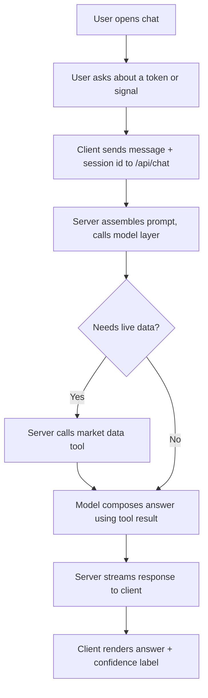
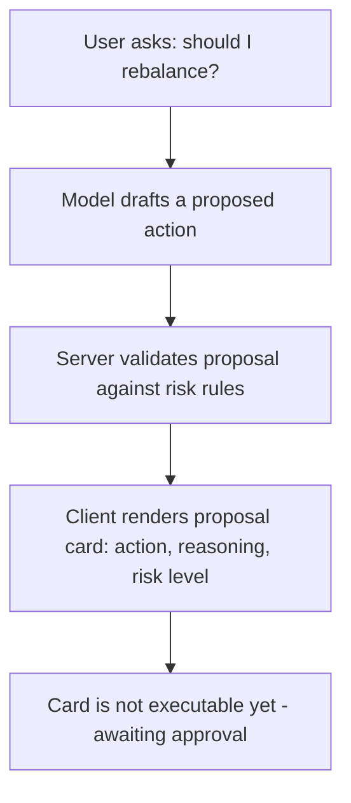
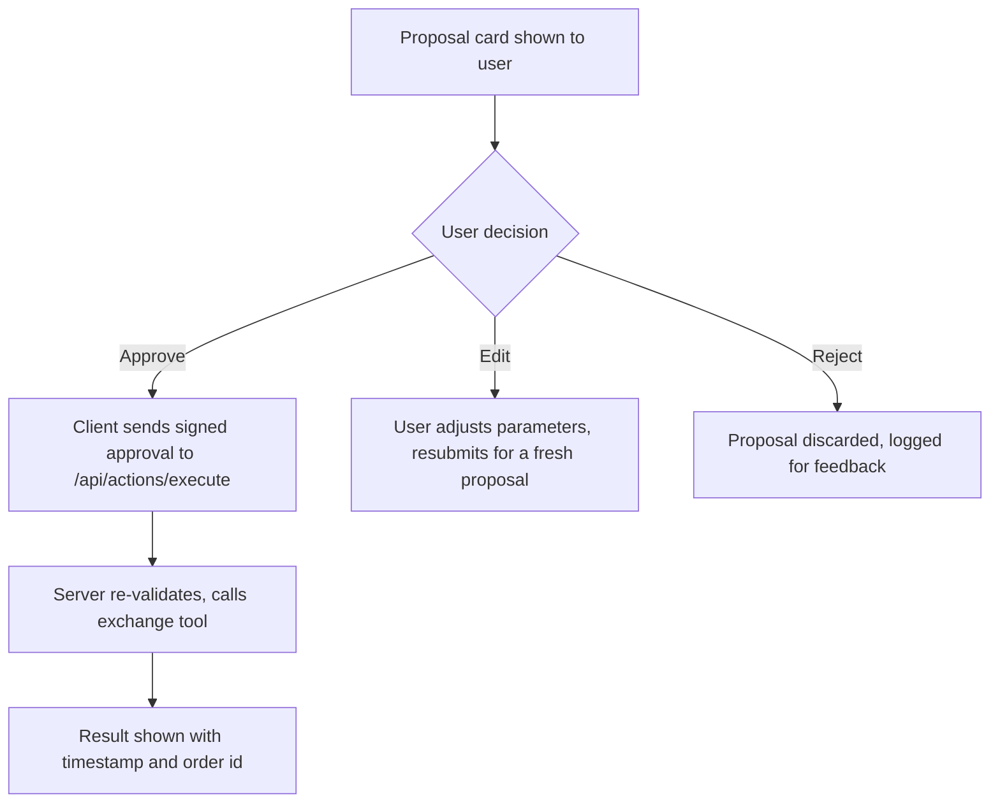
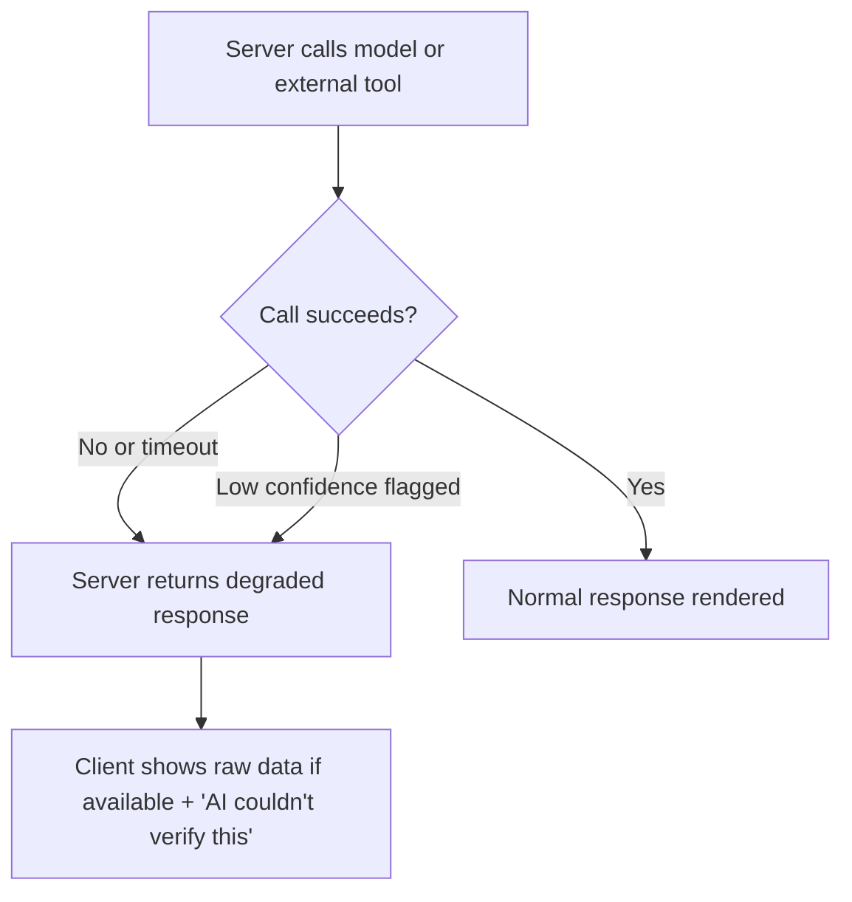

# CoinPilot AI — Product Brief

**Module 1, Phase 1 — AI-Native Product Strategy & Frontend Architecture**

## One-liner

CoinPilot AI is a chat-first copilot for retail crypto traders: it explains market signals in plain language, drafts trade and portfolio suggestions, and requires explicit human approval before anything ever touches a wallet or exchange account.

## Target users

- **Primary** — retail crypto traders/investors who follow multiple tokens across exchanges and want faster signal interpretation without giving up control of their funds.
- **Secondary** — traders who currently rely on manually scanning Telegram/Discord "calls" and want an assistant that cross-checks a call against live market data before they act on it.

## Jobs-to-be-done

1. "When I see a trading signal or a token call, help me quickly understand whether it's worth acting on, so I don't have to manually pull up charts and cross-reference exchanges myself."
2. "When I'm reviewing my portfolio, help me spot risk concentration or stale positions, so I can make an informed adjustment."
3. "When I decide to act, let me approve exactly what happens before it happens, so an AI never trades on my behalf without my sign-off."

## Core AI use cases

1. **Signal chat** — user references a token or signal; the AI explains what it means, pulls relevant live data via a tool call, and states a confidence level.
2. **Assistive drafting** — the AI drafts a suggested action (e.g. "reduce SOL exposure by 15%") with reasoning, as a proposal object — never as an executed action.
3. **Review & approval** — every AI-drafted action renders as a structured card the user must explicitly approve, edit, or reject before it can reach an execution endpoint.
4. **Fallback / degraded mode** — when market data is stale, the model is uncertain, or a tool call fails, the UI falls back to raw source data with a clear "AI couldn't verify this" notice instead of a confident-sounding guess.

## User flows

### 1. Chat flow

### 2. Assistive action flow

### 3. Review / approval flow

### 4. Fallback flow

## State management — early decisions

- **Conversation history**: stored server-side per session, keyed to a session id. Only the current session's messages are sent to the model as context — no cross-user or cross-session leakage.
- **Session state**: short-lived server session (auth token + session id). The client only ever holds an opaque session reference, never exchange credentials.
- **Saved preferences**: risk tolerance, watchlist, unit display — stored server-side, fetched on load, edited through a settings action. Not embedded in every model prompt by default; pulled in only when relevant, to limit what leaves the server per request.
- **Why server-side, not localStorage**: sensitive trading context never sits in browser storage where it could be read by another script or a compromised device, and it can be centrally revoked or cleared.

## AI provider choice

**Chosen for this track: Anthropic Claude, via the Messages API.**

Rationale: strong tool-use support for the market-data and validation tool calls this product depends on, and a clean fit for the propose-then-approve pattern — the model can request an action but never execute one directly.

This choice is swappable. The Vercel AI SDK (introduced next module) abstracts the provider behind a common interface, so frontend code doesn't need to change if the provider changes later — only the server-side provider adapter would.
