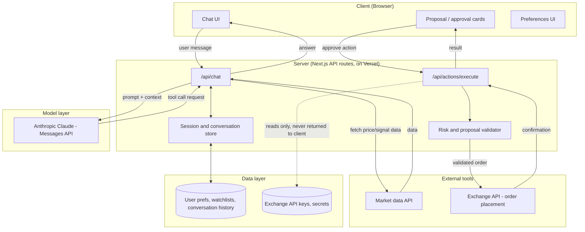

# System Boundary Diagram

This shows exactly what runs where: the browser (client), the Next.js server, the AI model layer, external tools, and the data layer. No path from the client reaches an exchange directly — every order goes through server-side validation first.

## Boundary rules — what runs where

| Layer | Runs | Holds | Never holds |
|---|---|---|---|
| Client (browser) | Chat UI, proposal cards, settings form | Rendered messages, opaque session id | Exchange API keys/secrets, raw system prompt, other users' data |
| Server (Next.js API routes) | Prompt assembly, tool orchestration, proposal validation, auth | Session reference, short-lived request context | Long-term secret storage (delegated to data layer / secrets manager) |
| Model layer (Claude, Messages API) | Reasoning, drafting answers and proposals, tool-use requests | Only the context the server explicitly sends it | Exchange credentials, or the ability to execute a trade itself |
| External tools | Market data API, exchange API | Their own auth, called server-side only | Direct access from the client |
| Data layer | Database, secrets manager | Conversation history, preferences, encrypted API keys | — |

## Key boundary decision

The model can **request** a tool call (e.g. "place this order") but only the server-side validator can actually call the exchange API — and only after an explicit user approval was captured on the client and re-verified server-side against the exact proposal. The model never receives exchange secrets in its context, and the client never receives them either.
